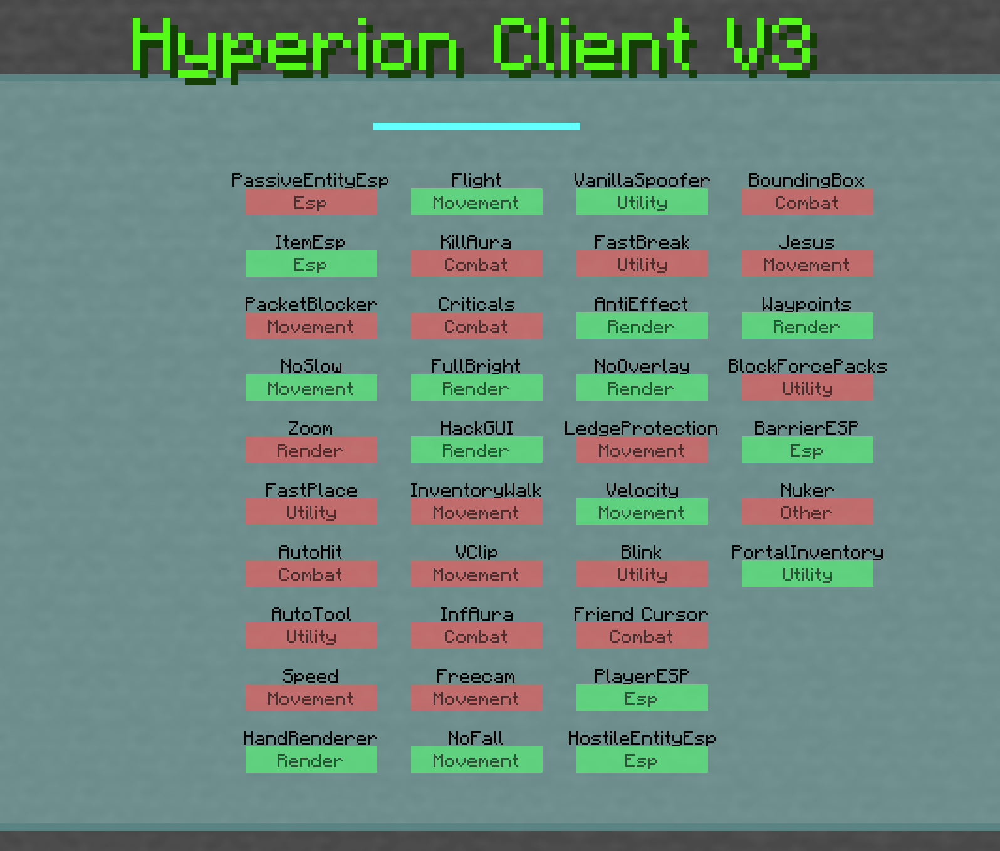

# Hyperion Client



## Preface
This project is a Minecraft Client side mod, that is often referred to as a "Hacked Client" or "Cheating Client". This is meant to give advantages to the players by abusing packets and exploits. Many public "Hacked Clients" are sketchy, and may contain malware. For this reason, I prefer making my own, I also gain Java experience and knowledge on how the exploits work.

## V1
This was actually my first Java project and what got me into Java in the fist place. From this, you can probably make it that this version was very scuffed, but nonetheless gave me valuable experience. I added many hacks to this version with hacks such as:
* Flight
* Kill Aura (Attack things automatically)
* Fast Break
* Jesus (Walk on water)
* Horrible teleportation implementation (11 block range)
* & many others
After working on this for a while, I became better at Java, I realized that the project was based on fundamentaly horrendous and inefficent code. By far the most glaring issue was the lack of an events system, instead every method was called every tick and checked whether or not it should be active, this was inefficent and slow. Another glaring issue was that the GUI was burried within menus and wasn't much of a GUI; it had no options or configurations, and didn't save hack states (on or off).

## V2
Around 8 months later, I come back with much more Java experience. This version was fundamentaly way better than the previous version. Here is a list of improvements:
* Added a good GUI
* Much better performance
* Added an events system (still minor flaws)
However, eventually, I got somewhat bored, and stopped working on it. I didn't work on this for long, though I had setup a good GUI and events system, I had only added about 20 hacks compared to the ~50 on the original. This wasn't enough and it was still preferable to use the old bad hacks rather than this new system with less hacks. Additionally it had a few flaws:
* Event system was based on runtime methods instead of compile time methods (this made it hard to debug).
* Hack options were broken and didn't work correctly
* Few hacks
* My lack of understanding in matrices and rendering

## V3
About a year later I went back, this time I was determined to make a better client; I was sick of using the old ad hoc V1 client. Here is a list of improvements:
* Added all necessary hacks and more (~40 hacks)
* Added a better GUI with a search a working options
* Compile Time event system (Interfaces)
* Object Oriented Structure
* Added Rendering Hacks using matrices (ESP, HackList)
* Updated to latest version and facilitated updating to future versions
* Added teleport exploit to allow teleporting over 100 blocks
* Criticals triggering automatically
These were crucial to having a better client, I wanted to make sure that I didn't ever have to use that makeshift V1 client. This time, I had finally done it right, everything worked as expected. I am still happy with this version today, and wouldn`t change anything. This version isin`t finsihed yet, I still need to revisit it and add more hacks but I currently have enough concurrent projects. As it stands today it`s superior than the V1 and V2 in every way.


## Teleport Showcase
Before ending this off, I though I would share some interesting exploits and hacks.
```java
    public static void packetTpToPos(Vec3d pos, MinecraftClient client, boolean updateClient, Vec3d playerPos, boolean onGround) {
        int PacketAmount = (int) Math.ceil(pos.distanceTo(playerPos) / 9) + 1;
        while (PacketAmount > 0) {
            PacketAmount --;
            PacketUtil.sendPosImmediately(client.player.getPos(), onGround);
            if (updateClient) client.player.setPos(client.player.getX(), client.player.getY(), client.player.getZ());
        }

        PacketUtil.sendPosImmediately(pos, onGround);

        if (updateClient)
            client.player.setPos(pos.getX(), pos.getY(), pos.getZ());
    }
```
This is the code that allows teleporting past 11 blocks. The server has a maximum delta of distance for which you can move within the same tick. By repeatedly sending the same position packet within the same tick, that cap is increased for some reason and we can move wild distances.


## Infinite Aura Code Showcase
```java
    public void onSwing(EventData data) {
        MinecraftClient client = MinecraftClient.getInstance();

        //check for cooldown
        if (waitCooldown.getValue() && client.player.getAttackCooldownProgress(0) != 1.0) return;

        List<Entity> entityList = PlayerUtils.getEntitiesWithinRange(PlayerUtils.getServerPosition(), this.range.getValue(), client);
        if (entityList.isEmpty()) return;

        PlayerUtils.parseAttackableEntities(entityList, targetPlayers.getValue(), targetHostileMobs.getValue(), targetPassiveMobs.getValue(), true, true);
        if (entityList.isEmpty()) return;

        List<Entity> toAttack = PlayerUtils.getAttackListFromEntityTargets(entityList, null, entityTargetPriority.getValue(), PlayerUtils.getServerPosition());
        Entity entity = toAttack.get(0);

        Vec3d orginalPos = PlayerUtils.getServerPosition();
        Vec3d tpPos = entity.getPos();
        if (!isSuitablePos(BlockPos.ofFloored(tpPos), client) || randomizePos.getValue()) tpPos = getPosAround(entity.getPos(), entity, 3, client);
        if (tpPos == null) return;
        PlayerUtils.packetTpToPos(tpPos, client, false, orginalPos);

        Criticals criticals = (Criticals) ModuleHandler.getModuleByClass(Criticals.class);
        if (criticals != null && criticals.isEnabled() && !blockCrit.getValue()) criticals.crit(tpPos);

        PacketUtil.attackEntityImmediately(entity);
        if (fakePlayer != null) fakePlayer.despawn();
        fakePlayer = new FakePlayerEntity(tpPos.x, tpPos.y, tpPos.z);

        PlayerUtils.packetTpToPos(orginalPos, client, false, tpPos);

        if (swingHand.getValue()) PacketUtil.doFakeHandSwing(Hand.MAIN_HAND);
    }
```
This code utilizes the telporting exploit to allow attacking entities from very far away. Put simply, we teleport near them, attack them and teleport back within the same tick.


<style>
.button {
  border: none;
  color: white;
  text-align: center;
  text-decoration: none;
  display: inline-block;
  font-size: 16px;
  margin: 4px 2px;
  cursor: pointer;
}

.repo {
 padding: 8px 25px;
 background-color: #008CBA;
} /* Blue */


.repo {
  background-color: white;
  color: black;
  border: 2px solid #008CBA;
}

.repo:hover {
  background-color: #008CBA;
  color: white;
}

.back {
  padding: 12px 100px;
  background-color: #aa0405;
} /* Red */

.back {
  background-color: white;
  color: black;
  border: 2px solid #aa0405;
}

.back:hover {
  background-color: #aa0405;
  color: white;
}
</style>

<a target="_blank" 	href="https://github.com/Hypericat/HyperionClientV3"> <button class="button repo">Visit Repository</button></a>

<a href="./"> <button class="button back">Back</button></a>