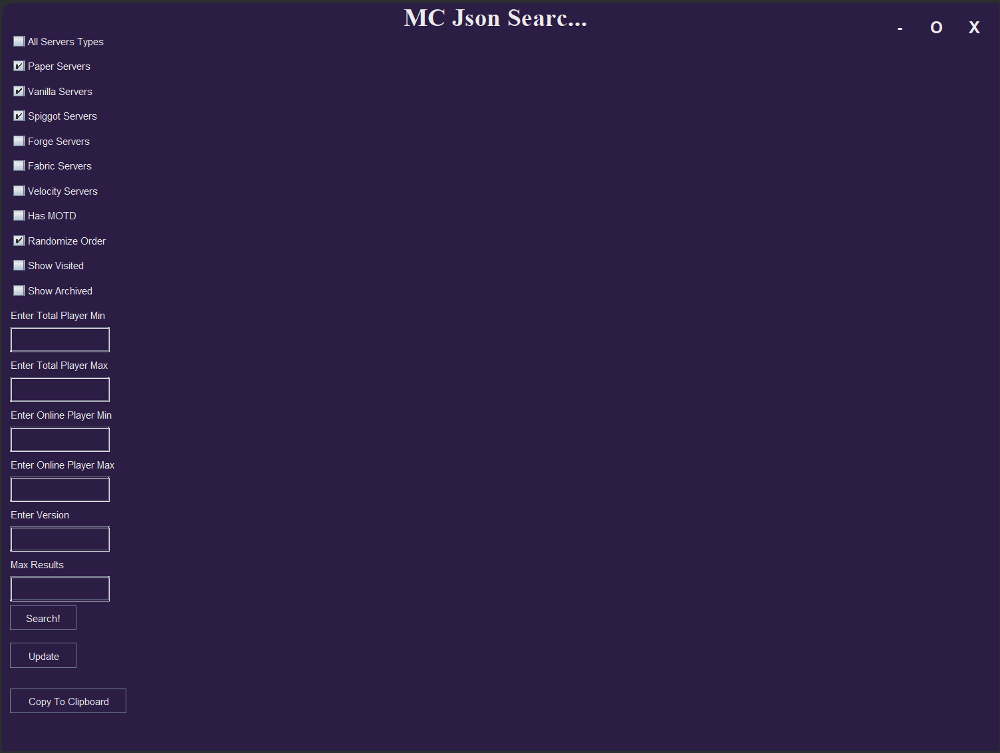

# Minecraft IP Scanner



## Explanation
All Minecraft servers are hosted on port 25565 by default. This includes private Minecraft servers made by friend groups all over the world. Since IPv4 addresses are stored as 4 8-bit sections (32 bits) there are only 2 ^ 32 possible IP addresses (~4.1B). This is small enough for a computer to realistically search through. This project scans throughout all possible IPs and log servers. Additionally, the Minecraft Protocol specifies a ping packet, this is used when the Minecraft client loads server information in the multiplayer tab. The server returns some basic data such as online players, server name, max player count and online player count. 

## Original Project

This is the old iteration of the project, [here](https://github.com/Hypericat/MinecraftIPScanner) is a link to the old repository.
The goal was to create a database of all Minecraft servers. The original scanner was written in Java, I created this before the Headless Client and therefore had limited experience with both TCP and the Minecraft Protocol. The scanner uses multithreading to create many instances scanning many IPs asynchronously (~5000 concurrent threads). This meant that the entire internet could be scanned within 3 days. The scanner sends fake Minecraft ping packets to receive information from the server. The response is save to many JSON files. Once we have scanned the internet, we can easily update our list of all servers by pinging them once again (since we know their addresses). This means that we can make a live feed, of where every Minecraft Player is playing on which server, and look it up. This is the GUI seen above, which parses through the JSON files and allows setting filters. 
	
```java
    public void ping(File logsPath, int timeOut, int port) {
        //Util.print("Pinging " + this.formatToString());
        byte[] handshake;
        try {
            handshake = getHandshake(port);
        } catch (IOException e) {
            Util.print("Failed to generate handshake for " + this.formatToString());
            return;
        }
        Optional<String> result;
        try {
            result = sendPacketHandshake(handshake, new Socket(), port, timeOut);
        } catch (IOException e) {
            //Util.print("Failed to send packet handshake for ip " + this.formatToString());
            this.shouldArchive = true;
            return;
        }
        if (result.isEmpty()) {
            Util.print("Handshake packet returned with error");
            this.shouldArchive = true;
            return;
        }
        String json = result.get();
        if (json.equals("Timeout")) {
            Util.print("IP address " + this.formatToString() + " timeout or closed port");
            this.shouldArchive = true;
            return;
        }
        File dir = FileHandler.createAndTestDir(new File(logsPath + "\\" + this.formatToString()));
        for (File file : Objects.requireNonNull(dir.listFiles())) {
            try {
                if (file.isFile() && FileHandler.readFromFile(file).get(0).equals(json)) {
                    Util.print("Found open server but data was already recorded : " + this.formatToString());
                    file.renameTo(new File(file.getParent() + "\\" + System.currentTimeMillis()));
                    return;
                }
            } catch (IndexOutOfBoundsException e) {}
        }
        File jsonFile = FileHandler.createAndTestFile(new File(dir.getAbsoluteFile() + "\\" + System.currentTimeMillis() + ".json"));
        FileHandler.overWriteToFile(jsonFile, json);
        Util.print("Successfully saved data for ip " + this.formatToString());
    }
````
Method to ping an IP.

## Usage

After scanning the entire internet, I had around 100,000 servers discovered, the directory containing the files became very slow. In retrospect, I should have used a different logging system, the raw amount of data was unexpected. With those 100,000 servers, we can sort them and apply filters to get correct versions, and join any of them. I tried a few and said hi to online players who were quite confused on how I managed to join their private (often school) servers.

## Rewrite

After finishing the Headless Client, my itch for scanning servers reappeared. This time, I wanted to go bigger and better. The previous iteration had many flaws, here are the most significant:
* Slow loading time for parsing the JSONS
* Lack of filtering for whitelists
* Slow scanning (Took around 6 days in real life conditions)
* Horrible Logging and Storage (In a directory, by far the worst issue)
* Lack of real time tracking of players
	
To fix these issues, I decided to write the new scanner in C++. This would allow more control over networking and threads and generally be faster. This project is still in progress as of now, however the scanning capabilities are finished. The Headless Client could try logging in and see whether or not the server is has the whitelist toggled. This would avoid having to manually check each server to see whether I could even join it. The data will be parsed as it is received rather than parsing it from JSONs every time it needs to be used.
	

## SQL Integration

To fix horrible logging issues, I want to implement an SQL database server on the server scanning it. This would allow having two versions of the program, a backend for scanning and frontend for viewing and searching IPs. The frontend would connect to the SQL server hosted and I (and any other users) could therefore request the data from the main server from any computer or location. Additionally, this is a much more robust way of logging, they way you're supposed to do it.

<style>
.button {
  border: none;
  color: white;
  text-align: center;
  text-decoration: none;
  display: inline-block;
  font-size: 16px;
  margin: 4px 2px;
  cursor: pointer;
}

.repo {
 padding: 8px 25px;
 background-color: #008CBA;
} /* Blue */


.repo {
  background-color: white;
  color: black;
  border: 2px solid #008CBA;
}

.repo:hover {
  background-color: #008CBA;
  color: white;
}

.back {
  padding: 12px 100px;
  background-color: #aa0405;
} /* Red */

.back {
  background-color: white;
  color: black;
  border: 2px solid #aa0405;
}

.back:hover {
  background-color: #aa0405;
  color: white;
}
</style>

<a target="_blank" 	href="https://github.com/Hypericat/MinecraftServerScannerV2"> <button class="button repo">Visit Repository</button></a>

<a href="./"> <button class="button back">Back</button></a>