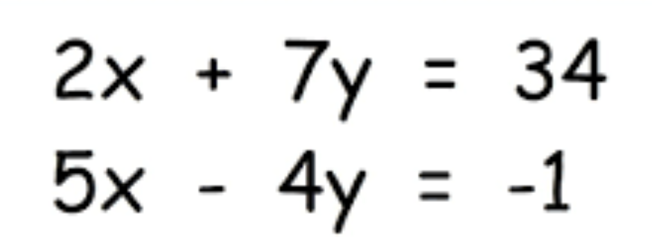
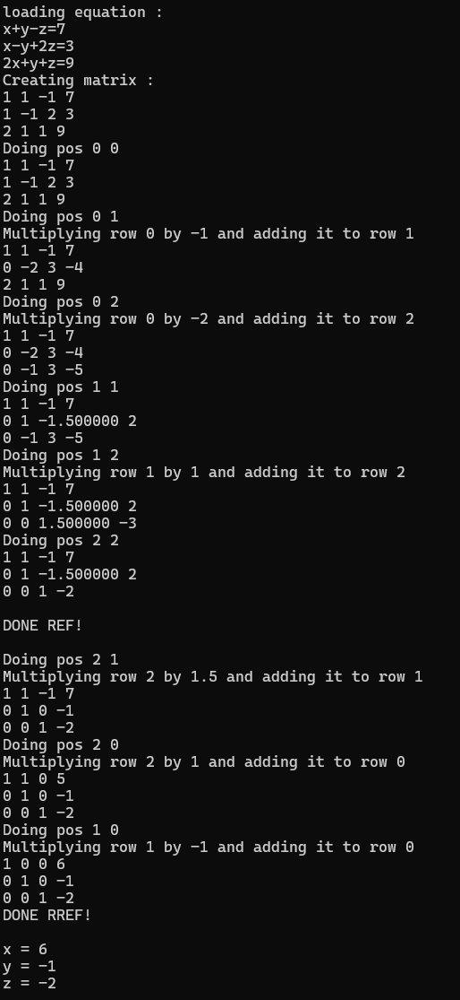

# Linear Algebra Equation Solver


## Explanation
This was one of my first C++ projects and helped me get a grasp of its special syntax. By this point I had a lot of Java experience and started branching out to C++. I worked on this this project along with [Buhbah6](https://github.com/Buhbah6). It solves linear systems of equations as seen above using Gauss Jordan Elimination in matrices with REF (Row Echelon Form) and RREF (Reduced Row Echelon Form). These equations can be solved by putting the coefficients into a Matrix. Our goal is to put the into REF, to do this we may use 3 operations:

### Swapping Rows
This is not used as it has no real use for computers, only for humans.
```java
void Matrixd::swapRows(int row1, int row2) {
    std::vector<double> rowV1 = this->getRow(row1);
    std::vector<double> rowV2 = this->getRow(row2);
    for (int i = 0; i < rowV1.size(); i++) {
        this->set(i, row2, rowV1[i]);
    }
    for (int i = 0; i < rowV2.size(); i++) {
        this->set(i, row1, rowV2[i]);
    }
}
```


### Multiply
Multiply a row by any coefficient
```java
void Matrixd::mult(int row, double coef) {
    std::vector<double> rowV = this->getRow(row);
    for (int i = 0; i < rowV.size(); i++) {
        this->set(i, row, rowV[i] * coef);
    }
}
```

### Multiply Add
This allows us to add a multiple of any row to a row.
```java
void Matrixd::multAddRow(int rowToMultiply, int rowToAddTo, double coef) {
    std::vector<double> rowV1 = this->getRow(rowToMultiply);
    std::vector<double> rowV2 = this->getRow(rowToAddTo);
    for (int i = 0; i < rowV1.size(); i++) {
        //std::cout << i << std::endl;
        //std::cout << "adding " << rowV1[i] * coef << std::endl;
        this->set(i, rowToAddTo, rowV1[i] * coef + rowV2[i]);
    }
}	
```

## Result
Once we have row reduced the matrix by using a combination of these operations, the program uses the same operations to turn it into RREF. This means going back from bottom to top and zeroing out the unwanted values. After this our answer appears in the matrix for each coefficient.

## Example Output

.button {
  border: none;
  color: white;
  text-align: center;
  text-decoration: none;
  display: inline-block;
  font-size: 16px;
  margin: 4px 2px;
  cursor: pointer;
}

.repo {
 padding: 8px 25px;
 background-color: #008CBA;
} /* Blue */


.repo {
  background-color: white;
  color: black;
  border: 2px solid #008CBA;
}

.repo:hover {
  background-color: #008CBA;
  color: white;
}

.back {
  padding: 12px 100px;
  background-color: #aa0405;
} /* Red */

.back {
  background-color: white;
  color: black;
  border: 2px solid #aa0405;
}

.back:hover {
  background-color: #aa0405;
  color: white;
}
</style>

<a target="_blank" 	href="https://github.com/Hypericat/HyperionClientV3"> <button class="button repo">Visit Repository</button></a>

<a href="./"> <button class="button back">Back</button></a>