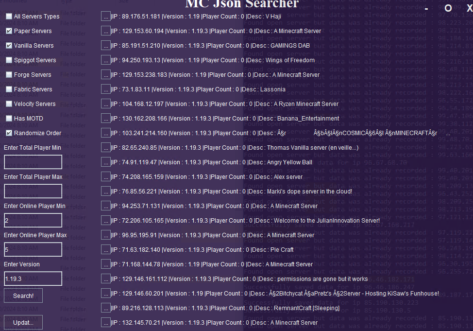
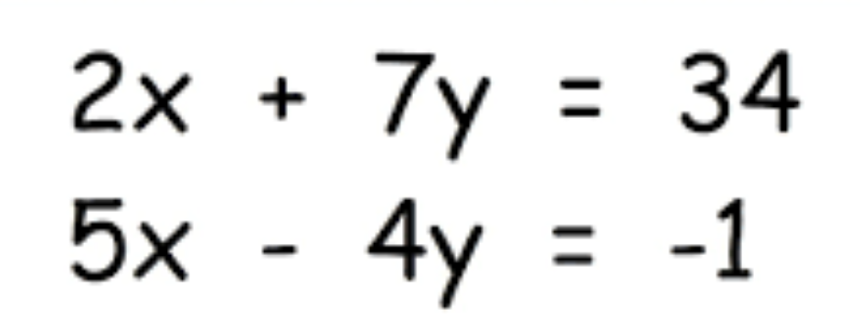

# Headless Minecraft Client

### Demonstration Video

<iframe width="560" height="315" src="https://www.youtube.com/embed/I71i-_ZlKeU?si=VGT3ofPCdxJL5M2i" title="YouTube video player" frameborder="0" allow="accelerometer; autoplay; clipboard-write; encrypted-media; gyroscope; picture-in-picture; web-share" referrerpolicy="strict-origin-when-cross-origin" allowfullscreen></iframe>

<a target="_blank" href="https://github.com/Hypericat/HeadlessMC"> <button class="button button2">Visit Repository</button></a>

<a href="./HeadlessMC.html"> <button class="button button1">Learn More!</button></a>
	
	
	
	
	
# Minecraft IP Scanner

### Searching GUI

<a target="_blank" href="https://github.com/Hypericat/MinecraftServerScannerV2"> <button class="button button2">Visit Repository</button></a>

<a href="./IPScanner.html"> <button class="button button1">Learn More!</button></a>

# Hyperion Client

### Hack List GUI

<a target="_blank" href="https://github.com/Hypericat/HyperionClientV3"> <button class="button button2">Visit Repository</button></a>

<a href="./HyperionClient.html"> <button class="button button1">Learn More!</button></a>

# Wordle Solver

### Completed Wordle using Solver

<a target="_blank" href="https://github.com/Hypericat/Wordle-Solver"> <button class="button button2">Visit Repository</button></a>

<a href="./WordleSolver.html"> <button class="button button1">Learn More!</button></a>

# Linear Systems of Equations Solver

### Example of a Linear System of Equations

<a target="_blank" href="https://github.com/Buhbah6/MATH204_LinearAdvancedCalculator"> <button class="button button2">Visit Repository</button></a>

<a href="./LinearAlgebraSolver.html"> <button class="button button1">Learn More!</button></a>

# SDL Renderer

### SDL Test Graphics

<a target="_blank" href="https://github.com/Hypericat/SDLRenderer"> <button class="button button2">Visit Repository</button></a>

<a href="./SDLRenderer.html"> <button class="button button1">Learn More!</button></a>